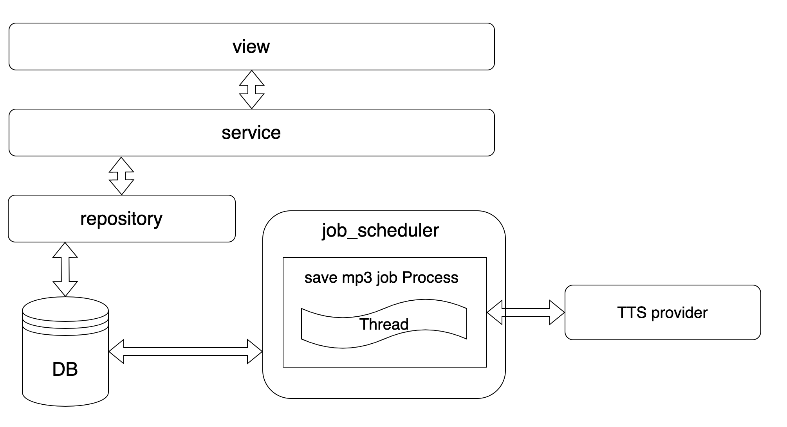

# TTS Provider
여러 문장을 가진 프로젝트를 생성하고, TTS를 통해 mp3 파일을 생성합니다.

# Install and config

- install

```bash
https://github.com/yomapi/tts_provider.git
cd tts_provider
poetry install
```

- config

```yaml
#/Users/yomapi/PycharmProjects/tts_provider/configs/config_real.yaml

databases:
  host: "host url"
  port: 3306
  database: "db name"
  username: "username"
  password: "passwd"
  timezone: "+09:00"

secrets:
  django: "django-insecure-something"

scheduler:
  interval_sec: 2 # mp3를 생성하는 job이 trigger 되는 주기 입니다.
  batch_size: 10 # 한 번에 생성할 mp3 파일의 개수 입니다.

token:
  scret: "JWT secret key"
  expire_sec: 3600
```

- run server

```bash
# /tts_provider

python manage.py runserver
```

# DB


# Architecture



- view:
    - client의 요청을 받고, service를 호출하고, 결과를 response 합니다
- service
    - 비지니스 로직이 들어있습니다. repository를 호출하여, DB를 조작하거나, 외부 API등을 호출합니다.
    - mp3파일을 생성하는 작업은 요청 받았을 때 바로 처리 하지 않고, job scheduler가 담당합니다.
- repository
    - DB와 통신을 책임집니다.
- job scheduler
    - django와는 별도의 프로세스로 띄워지는 스케쥴러 입니다.
    - 최대 프로세스 1개, 프로세스 당 최대 쓰레드 1개로 제한되도록 설정해두었습니다.
    - config_real.yml 에 설정한 {interval_sec}초에 한번 씩 {batch_size} 개의 텍스트를 가져와서 mp3를 생성합니다.
    - 텍스트는 is_audio_required 필드가 true인 것중 updated_at이 가장 과거인 것부터 가져옵니다.
    - 2초 안에 save mp3 job이 끝나지 않더라도, 중복되어 job이 실행되지 않고 skip 됩니다.

# Features

<aside>
💡 회원가입, 로그인을 제외한 모든 기능은 로그인이 필요합니다.

</aside>

- 회원가입
    - 이름, email, 비밀번호를 받아 유저를 생성합니다.
- 로그인
    - email과 비밀번호를 받아, 로그인을 합니다. JWT 을 response 합니다.
- 프로젝트 생성(오디오 생성)
    - 텍스트(str)와 프로젝트 이름을 받아 프로젝트를 생성합니다
    - 오디오는 input의 path에 저장됩니다.
- 텍스트 조회
    - 해당 텍스트를 작성한 유저만 조회할 수 있습니다.
    - 특정 프로젝트의 n번째 페이지를 조회합니다.
    - 한페이지는 10문장으로 이루어져 있습니다.
- 텍스트 수정
    - 해당 텍스트를 작성한 유저만 수정할 수 있습니다.
    - 한 문장의 텍스트와 스피드를 수정합니다.
- 오디오파일 송신
    - 해당 오디오의 텍스트를 작성한 유저만 요청할 수 있습니다.
    - 요청받은 오디오파일을 송신합니다.
- 텍스트(오디오) 생성 / 삭제
    - 해당 텍스트를 작성한 유저만 요청할 수 있습니다.
    - 삽입위치는 항상 앞, 뒤가 아닌 중간도 가능.
- 프로젝트 삭제
    - 해당 프로젝트를 작성한 유저만 요청할 수 있습니다.
    - 해당 프로젝트의 오디오 파일 및 DB의 오디오 데이터도 함께 삭제됩니다.

# API Documentation

<aside>
💡 이 프로젝트는 swagger를 제공하고 있습니다.
{root_url}/swagger/ 로 접속하여, swagger 문서화를 확인하는 것을 추천합니다.

</aside>

<aside>
💡 회원가입, 로그인을 제외한 모든 기능은 로그인이 필요합니다.

</aside>

## /audio/

- POST

Parameters

| Name | Located in | Description | Required | Schema               |
| ---- | ---------- | ----------- | -------- | -------------------- |
| data | body       |             | Yes      | CreateAudioReqSchema |

Responses

| Code | Description | Schema |
| ---- | ----------- | ------ |
| 201  |             | Audio  |

## /audio/{audio_id}

- POST

Parameters

| Name     | Located in | Description | Required | Schema               |
| -------- | ---------- | ----------- | -------- | -------------------- |
| audio_id | path       |             | Yes      | string               |
| data     | body       |             | Yes      | UpdateAudioReqSchema |

Responses

| Code | Description | Schema |
| ---- | ----------- | ------ |
| 201  |             | Audio  |
- DELETE

Parameters

| Name     | Located in | Description | Required | Schema |
| -------- | ---------- | ----------- | -------- | ------ |
| audio_id | path       |             | Yes      | string |

Responses

| Code | Description | Schema             |
| ---- | ----------- | ------------------ |
| 201  |             | IsSuccessResSchema |

## /audio/{audio_id}/mp3_file

- GET

Parameters

| Name     | Located in | Description | Required | Schema |
| -------- | ---------- | ----------- | -------- | ------ |
| audio_id | path       |             | Yes      | string |

Responses

| Code | Description |
| ---- | ----------- |
| 200  |             |

## /login/

- POST

Parameters

| Name | Located in | Description | Required | Schema             |
| ---- | ---------- | ----------- | -------- | ------------------ |
| data | body       |             | Yes      | UserLoginReqSchema |

Responses

| Code | Description | Schema             |
| ---- | ----------- | ------------------ |
| 201  |             | UserLoginResSchema |

## /project/

- POST

Parameters

| Name | Located in | Description | Required | Schema                 |
| ---- | ---------- | ----------- | -------- | ---------------------- |
| data | body       |             | Yes      | CreateProjectReqSchema |

Responses

| Code | Description | Schema  |
| ---- | ----------- | ------- |
| 201  |             | Project |

## /project/{project_id}

- DELETE

Parameters

| Name       | Located in | Description | Required | Schema |
| ---------- | ---------- | ----------- | -------- | ------ |
| project_id | path       |             | Yes      | string |

Responses

| Code | Description | Schema             |
| ---- | ----------- | ------------------ |
| 201  |             | IsSuccessResSchema |

## /project/{project_id}/page/{page}

- GET

Parameters

| Name       | Located in | Description | Required | Schema |
| ---------- | ---------- | ----------- | -------- | ------ |
| page       | path       |             | Yes      | string |
| project_id | path       |             | Yes      | string |

Responses

| Code | Description | Schema                |
| ---- | ----------- | --------------------- |
| 200  |             | GetPageResponseSchema |

## /signup/

- POST

Parameters

| Name | Located in | Description | Required | Schema              |
| ---- | ---------- | ----------- | -------- | ------------------- |
| data | body       |             | Yes      | UserSignUpReqSchema |

Responses

| Code | Description | Schema |
| ---- | ----------- | ------ |
| 201  |             | User   |

### Models

### CreateAudioReqSchema

| Name       | Type    | Description | Required |
| ---------- | ------- | ----------- | -------- |
| project_id | integer |             | Yes      |
| index      | integer |             | Yes      |
| text       | string  |             | Yes      |
| speed      | integer |             | Yes      |

### Audio

| Name              | Type     | Description | Required |
| ----------------- | -------- | ----------- | -------- |
| id                | integer  |             | No       |
| created_at        | dateTime |             | No       |
| updated_at        | dateTime |             | No       |
| index             | integer  |             | No       |
| text              | string   |             | Yes      |
| speed             | integer  |             | No       |
| path              | string   |             | No       |
| is_audio_required | boolean  |             | No       |
| project           | integer  |             | Yes      |
| user              | integer  |             | Yes      |

### UpdateAudioReqSchema

| Name  | Type    | Description | Required |
| ----- | ------- | ----------- | -------- |
| text  | string  |             | Yes      |
| speed | integer |             | Yes      |

### IsSuccessResSchema

| Name       | Type    | Description | Required |
| ---------- | ------- | ----------- | -------- |
| is_success | boolean |             | Yes      |

### UserLoginReqSchema

| Name     | Type   | Description | Required |
| -------- | ------ | ----------- | -------- |
| email    | string |             | Yes      |
| password | string |             | Yes      |

### UserLoginResSchema

| Name   | Type   | Description | Required |
| ------ | ------ | ----------- | -------- |
| access | string |             | Yes      |

### CreateProjectReqSchema

| Name      | Type   | Description | Required |
| --------- | ------ | ----------- | -------- |
| title     | string |             | Yes      |
| sentences | string |             | Yes      |

### Project

| Name          | Type     | Description | Required |
| ------------- | -------- | ----------- | -------- |
| id            | integer  |             | No       |
| created_at    | dateTime |             | No       |
| updated_at    | dateTime |             | No       |
| project_title | string   |             | No       |
| user          | integer  |             | Yes      |

### GetPageResponseSchema

| Name | Type      | Description | Required |
| ---- | --------- | ----------- | -------- |
| cnt  | integer   |             | Yes      |
| page | [ Audio ] |             | Yes      |

### UserSignUpReqSchema

| Name     | Type   | Description | Required |
| -------- | ------ | ----------- | -------- |
| name     | string |             | Yes      |
| email    | string |             | Yes      |
| password | string |             | Yes      |

### User

| Name       | Type     | Description | Required |
| ---------- | -------- | ----------- | -------- |
| id         | integer  |             | No       |
| created_at | dateTime |             | No       |
| updated_at | dateTime |             | No       |
| name       | string   |             | No       |
| email      | string   |             | No       |
| password   | string   |             | No       |